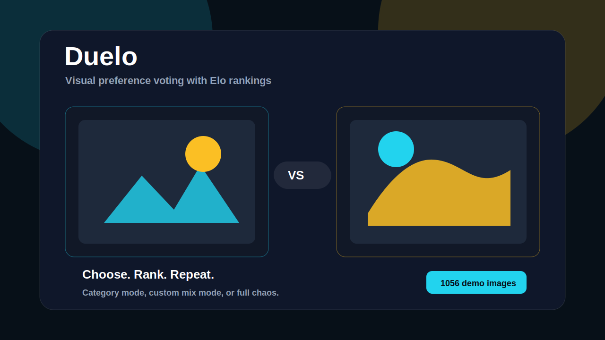

# Duelo



Duelo is a visual voting app: two images appear, the user clicks the preferred one, the winner stays, and the loser is replaced. Over time, the app builds rankings by category, niche, mixed playlists, or a full random mode.

The project started from a simple interaction idea: make preference voting fast enough to feel like a game, while keeping a real ranking model behind it.

[Repository](https://github.com/GuttoSP/duelo)

## What It Does

- Shows two images in a duel.
- Keeps the clicked image on screen and replaces the other one.
- Optionally randomizes the side of the winning image.
- Prevents the same image from appearing on both sides.
- Supports single category, custom mix, and full random mode.
- Keeps image orientation consistent: portrait, landscape, or square.
- Preloads a rolling buffer of images to reduce waiting between votes.
- Updates rankings with an Elo-style score.

## Modes

| Mode | Behavior |
| --- | --- |
| Category | Only one niche, such as cars, birds, cats, watches, or beach houses. |
| Mix | User-selected niches, such as cars + trees + motorcycles. |
| Chaos | Fully random across all available niches. |

## Demo Dataset

The demo includes **44 niches** and **1056 generated image entries**, with **24 images per niche**:

- Nature: forests, trees, mountains, waterfalls, beaches, deserts, lakes, plants, flowers, macro nature.
- Animals: cats, dogs, fish, cockatiels, birds, wild cats, horses, rabbits, marine animals, insects.
- Architecture and places: beach houses, country houses, modern houses, cities.
- Fashion: bikinis, jackets, swimsuits, dresses, suits, ties, kids beachwear, adult beachwear, adult winter fashion.
- Accessories and objects: rings, sandals, shoes, watches, knives.
- Vehicles and photography: motorcycles, bicycles, cars, space photos.

The app can run without PostgreSQL by using the demo data in memory.

## Stack

- Next.js App Router
- React
- TypeScript
- Tailwind CSS
- Prisma
- PostgreSQL
- Auth.js
- Node test runner

## Quick Start

```bash
npm install
npm run prisma:generate
npm run dev
```

Open:

```text
http://localhost:3000
```

## Optional PostgreSQL Setup

Copy the environment example:

```bash
cp .env.example .env
```

Configure `DATABASE_URL`, then run:

```bash
npm run prisma:migrate
npm run prisma:seed
```

Seed admin user:

```text
email: admin@duelo.local
password: duelo123
```

## Scripts

```bash
npm run dev
npm run build
npm run lint
npm run test
npm run prisma:generate
npm run prisma:migrate
npm run prisma:seed
```

## Current Implementation Notes

- Votes are persisted when PostgreSQL is configured.
- Without a database, the app falls back to in-memory demo data.
- The ranking model uses Elo-style updates.
- Image preloading keeps a rolling buffer for smoother voting.
- Upload is currently URL-based and marks images as pending.

## Roadmap

- Real object storage for uploads, such as S3, R2, or Supabase Storage.
- Server-side image resizing and crop variants.
- Dedicated login, moderation, and user-created duel pages.
- Realtime admin metrics.
- Offline vote queue for PWA usage.
- Public category pages and shareable rankings.

## License

MIT. Use it, copy it, modify it, and build on top of it.
