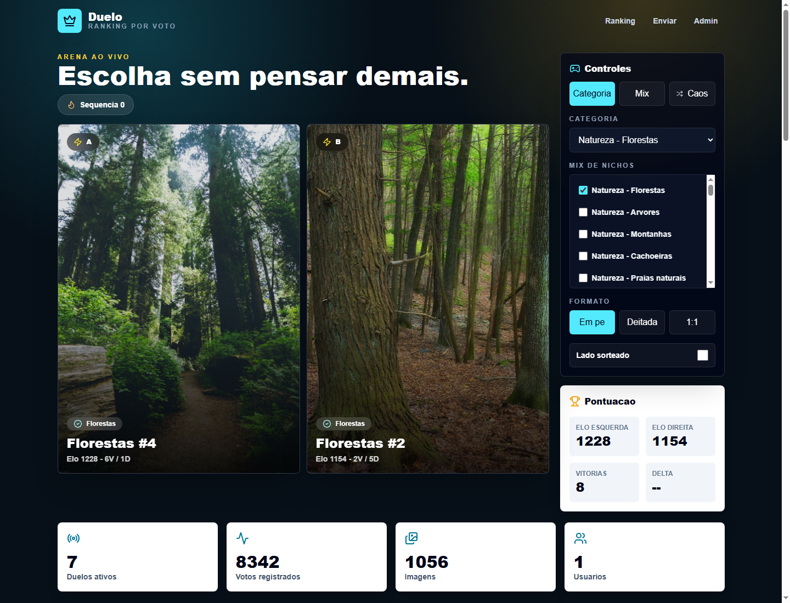
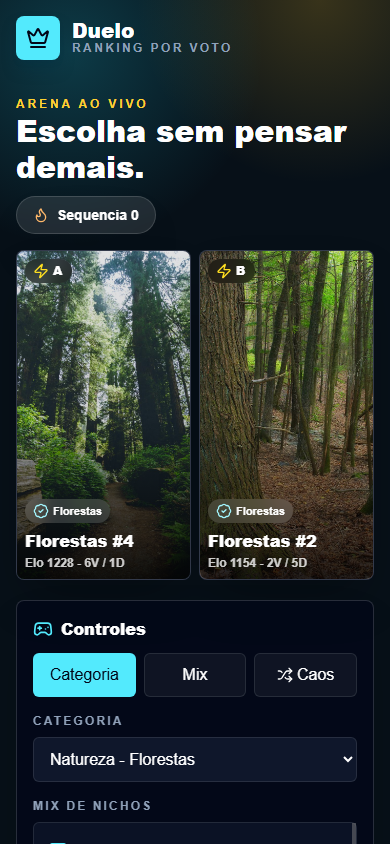
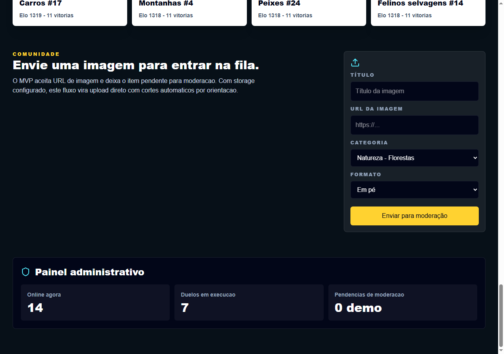
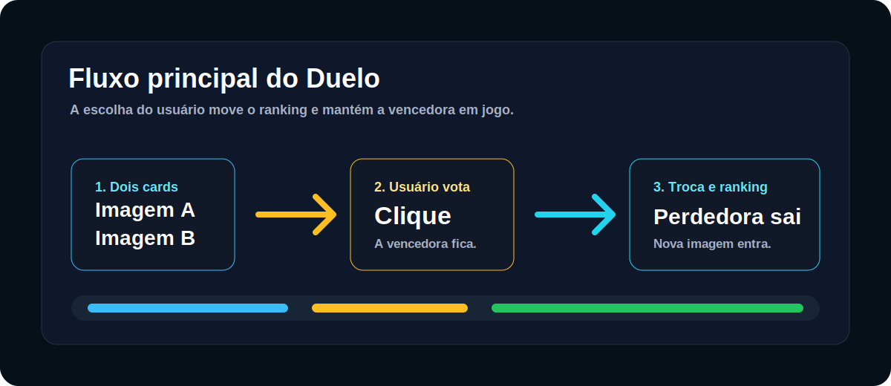
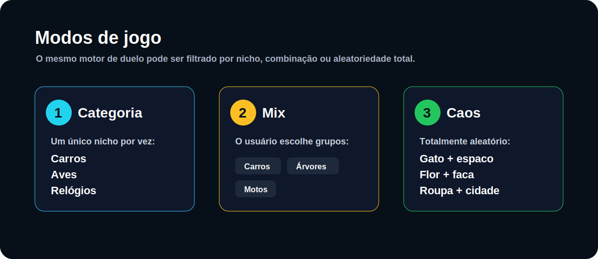
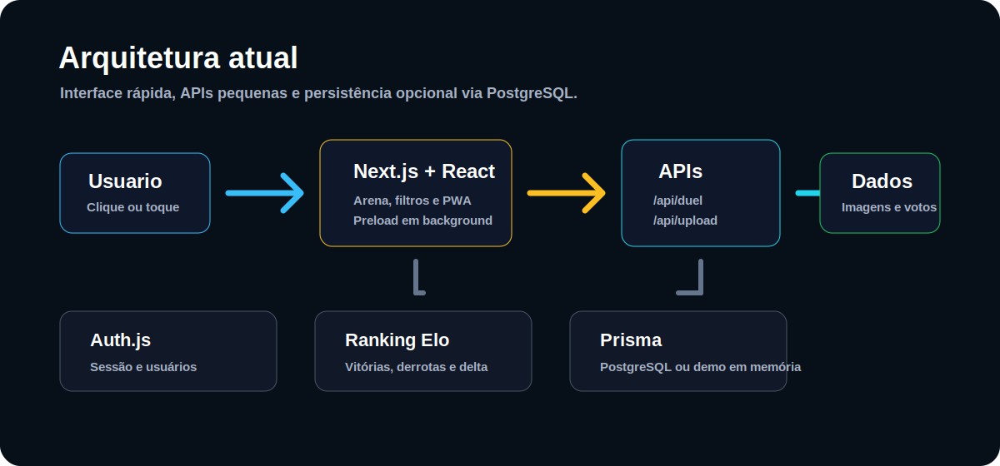

# Duelo

Duelo é um app de votação visual. A tela mostra duas imagens, o usuário escolhe uma delas e o sistema substitui a imagem que perdeu. A vencedora continua em jogo, acumulando histórico, vitórias e pontuação.

A proposta é simples na interface, mas não é apenas colocar duas fotos lado a lado. O app precisa controlar categorias, nichos, orientação das imagens, repetição, pré-carregamento, ranking e persistência.

## Prints

### Desktop



### Mobile



### Envio de imagem



## Guia de uso

O passo a passo completo fica em [USO.md](USO.md).

## Como funciona



1. O sistema escolhe duas imagens compatíveis com o modo atual.
2. O usuário clica ou toca na imagem preferida.
3. A imagem clicada permanece.
4. A imagem que perdeu sai da tela.
5. Uma nova imagem entra no lugar da perdedora.
6. O ranking é recalculado com uma atualização estilo Elo.

Por padrão, a imagem escolhida fica do mesmo lado. Existe também a opção de sortear o lado da vencedora. Mesmo nesse modo, a regra principal continua: a imagem clicada é a vencedora e permanece no duelo.

## Regras importantes

- A mesma imagem nunca deve aparecer simultaneamente dos dois lados.
- As duas imagens precisam respeitar o mesmo formato: em pé, deitada ou 1:1.
- O crop usa preenchimento visual para evitar distorção.
- O app mantém um buffer de imagens pré-carregadas em background.
- Conforme o usuário vota, o buffer é reposto para manter a experiência rápida.
- Sem PostgreSQL configurado, o projeto roda com dados demo em memória.

## Modos de jogo



| Modo | Uso |
| --- | --- |
| Categoria | Joga apenas um nicho, como carros, gatos, aves, relógios ou casas de praia. |
| Mix | Combina nichos escolhidos pelo usuário, como carros + árvores + motos. |
| Caos | Modo totalmente aleatório, misturando qualquer categoria disponível. |

## Categorias e dados demo

A base demo atual tem **44 nichos** e **1056 imagens**, com **24 imagens por nicho**.

Principais grupos:

- Natureza: florestas, árvores, montanhas, cachoeiras, praias naturais, desertos, lagos, plantas, flores, natureza macro e fotos da natureza.
- Animais: gatos, cachorros, peixes, calopsitas, aves, pássaros, felinos selvagens, cavalos, coelhos, animais marinhos e insetos.
- Arquitetura e lugares: casas de praia, casas de campo, casas modernas e fotos de cidades.
- Roupas: biquínis, jaquetas, maiôs, vestidos, ternos, gravatas, moda praia infantil, moda praia adulto e moda inverno adulto.
- Acessórios e objetos: anéis, sandálias, calçados, relógios e facas.
- Veículos e fotografia: motos, bicicletas, carros e fotos do espaço.

## Arquitetura



Stack principal:

- Next.js App Router
- React
- TypeScript
- Tailwind CSS
- Prisma
- PostgreSQL
- Auth.js
- Node test runner

O app foi estruturado para conseguir evoluir em três direções: PWA mobile, ranking persistente e moderação de imagens enviadas por usuários.

## Rodando localmente

```bash
npm install
npm run prisma:generate
npm run dev
```

Abra:

```text
http://localhost:3000
```

## PostgreSQL Opcional

Copie o arquivo de ambiente:

```bash
cp .env.example .env
```

Configure `DATABASE_URL`, depois rode:

```bash
npm run prisma:migrate
npm run prisma:seed
```

Usuário admin criado pelo seed:

```text
email: admin@duelo.local
password: duelo123
```

## Scripts

```bash
npm run dev
npm run build
npm run lint
npm run test
npm run prisma:generate
npm run prisma:migrate
npm run prisma:seed
```

## Estado atual

- Arena funcional com duelo entre duas imagens.
- Categoria única, mix de nichos e modo caos.
- Ranking com atualização estilo Elo.
- Pré-carregamento contínuo de imagens.
- Fallback demo sem banco.
- PWA com manifest, ícones maskable, service worker e tela offline.
- Upload por URL com imagem pendente; sem PostgreSQL, o envio fica em memória até reiniciar o servidor.
- Base para autenticação com Auth.js.

## Próximos Passos Naturais

- Armazenamento real de uploads, como S3, R2 ou Supabase Storage.
- Redimensionamento e variantes de crop no servidor.
- Páginas públicas por categoria e ranking compartilhável.
- Moderação de imagens enviadas por usuários.
- Fila offline de votos para PWA.
- Painel administrativo em tempo real.

## Licença

MIT. Pode copiar, estudar, modificar e usar como base para outro projeto.
